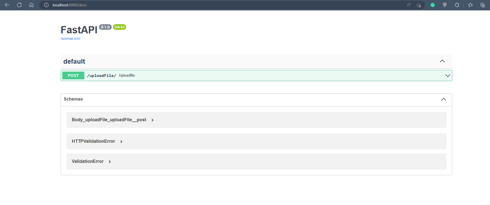

# PDF Parser (RAW)

## Program Overview
This Python API acceptes PDF files in the request body and returns all text extracted from the file in the response body.

## Usage

### Virtual Environment
All required librarires can be found in the `requirements.txt` file. Create a virtual environment, activate it and install the libraries using the following command
```bash
pip install -r requirements.txt
```
### Running Program
Start the program by running the command in the terminal
```bash
uvicorn main:app
```

### Process Request
Go to the following URL in your browser
```bash
localhost:8000/docs/
```

This will take you to a UI provided by FastAPI. You can interact with all the functionality provided by the API o this page.



1. Click on the created POST request
2. Click on "Try it out"
3. Upload PDF file and submit
4. Text should be returned in response body
